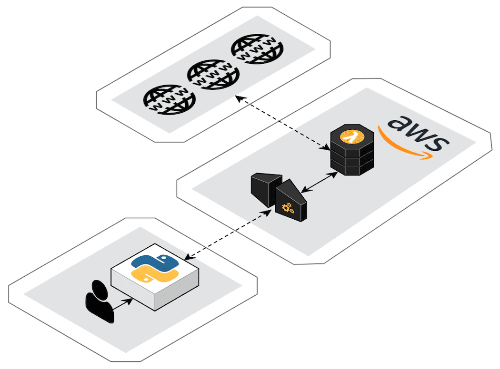
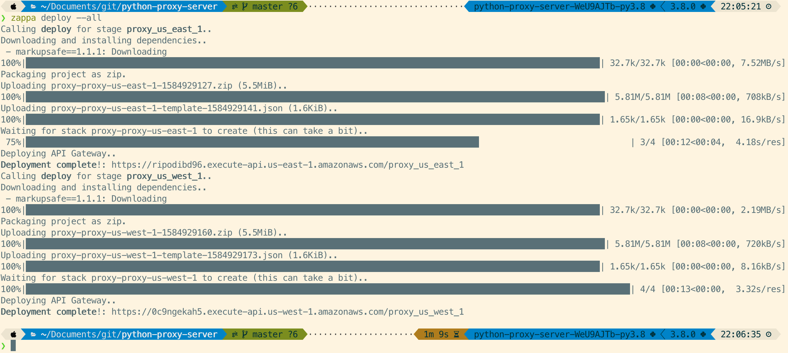
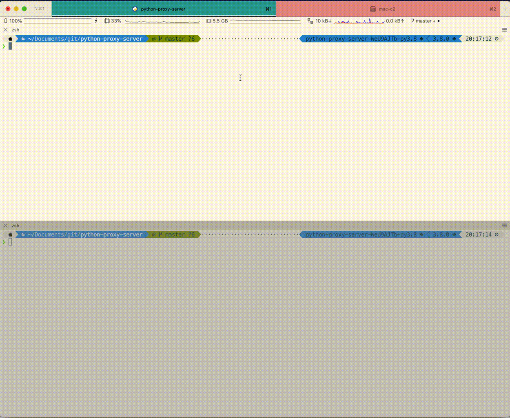

# Python Proxy Server

Amazon Web Services' (AWS) serverless offering, [AWS Lambda](https://aws.amazon.com/lambda/), is part of their "always free tier". What that means is you get 1 million requests per month, or 3.2 million seconds of compute time per month, for free. Forever. 

You can deploy a simple flask app on lambda, which will make your web requests for you from within AWS. The deployment is seamlessly handled by [zappa](https://github.com/Miserlou/Zappa), a framework for managing serverless Python applications.

<p align="center">
    
</p>

## Setup

1. Clone repo
2. Run `poetry install --no-root` from the root of the repo to create a new virtual environment with the three project dependencies; [zappa](https://github.com/Miserlou/Zappa), [requests](https://github.com/psf/requests) and [flask](https://github.com/pallets/flask). If you don't have poetry install, you can install it as per the instructions [here](https://python-poetry.org/docs/#osx-linux-bashonwindows-install-instructions). Alternatively, you can use [pipenv](https://github.com/pypa/pipenv) or manually create a [virtual environment](https://docs.python.org/3/tutorial/venv.html) with the three aforementioned dependencies.
3. **[optionally]** Configure the `zappa_settings.json`

Out of the box, this repo will deploy two proxy servers, one in `us-east-1` and one in `us-west-1`.

```json
{
    "proxy_us_east_1": {
        "app_function": "proxy.app",
        "aws_region": "us-east-1",
        "project_name": "proxy",
        "runtime": "python3.8",
        "exclude": ["*.png", "*.gif"]
    },
    "proxy_us_west_1": {
        "app_function": "proxy.app",
        "aws_region": "us-west-1",
        "project_name": "proxy",
        "runtime": "python3.8",
        "exclude": ["*.png", "*.gif"]
    }
}
```

Note, the `"exclude": ["*.png", "*.gif"]` setting prevents the files in the `media` folder of this repo from being included in the lambda deployment package. If you are working from scratch in your own repo, you can remove this. The zappa config can be easily modified to suit your needs, by removing or adding more lambda functions in other regions. See the [zappa docs](https://github.com/Miserlou/Zappa#advanced-settings/) for a full list of settings than can be configured in `zappa_settings.json`.

4. Deploy all lambda functions by running `zappa deploy --all`



5. Make requests through the proxy, and load the pickled response:

```python
import pickle
import requests

# Be sure to grab the API gateway URLs outputted by **your** zappa deploy call...
PROXY_EAST = 'https://ripodibd96.execute-api.us-east-1.amazonaws.com/proxy_us_east_1'
PROXY_WEST = 'https://0c9ngekah5.execute-api.us-west-1.amazonaws.com/proxy_us_west_1'

proxy_response = requests.post(
    PROXY_EAST,
    data={'url': 'https://ianwhitestone.work'}
)
response = pickle.loads(proxy_response.content)
```

You can now interact with the requests response object as you would normally:

```python
>>> response
<Response [200]>
>>> response.text
'<!DOCTYPE html>\n<html>\n  <head>\n    <title>Ian Whitestone</title>\n\n ...
...
```


## Demos

### Local demo

Here's a demo of running the proxy server locally, with `python proxy.py`:



### Deployed demo

After running `zappa deploy --all`, we can grab the URL for the proxy we want to use and make a post request against it:

